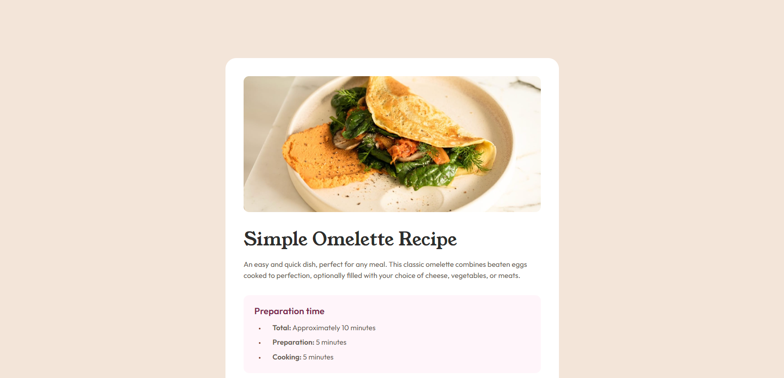

# Frontend Mentor - Recipe page solution

This is a solution to the [Recipe page challenge on Frontend Mentor](https://www.frontendmentor.io/challenges/recipe-page-KiTsR8QQKm). Frontend Mentor challenges help you improve your coding skills by building realistic projects.

## Table of contents

- [Overview](#overview)
  - [The challenge](#the-challenge)
  - [Screenshot](#screenshot)
  - [Links](#links)
- [My process](#my-process)
  - [Built with](#built-with)
  - [What I learned](#what-i-learned)
- [Author](#author)

## Overview

### Screenshot



### Links

- Solution URL: [Solution](https://github.com/kalihari90/frontend-mentor-4)
- Live Site URL: [Live](https://kalihari90.github.io/frontend-mentor-4/)

## My process

### Built with

- Semantic HTML5 markup
- CSS custom properties
- Flexbox
- CSS Grid

### What I learned

I've learnt to better organise my code. Biggest challenge was spacing ordered list and the mobile version. There was a lot of media queries on the mobile, but that's the cost of the desktop-first approach, which I prefer.

Mobile version media queries:

```css
@media (max-width: 375px) {
	.container {
		max-width: 100%;
		margin: 0;
	}
	.card {
		margin-block: 0;
		border-radius: 0;
		padding: 0;
		gap: 0;
	}

	.top-image {
		height: 17.1rem;
		border-radius: 0;
	}

	.text-content {
		padding: 4rem 3.2rem;
	}

	h1 {
		font-size: 3.6rem;
	}

	.attribution {
		margin-top: 4rem;
	}

	.instructions ol {
		gap: 0.8rem;
	}

	.instructions span {
		padding-left: 1.6rem;
	}
}
```

## Author

- GitHub - [kalihari90](https://github.com/kalihari90)
- Frontend Mentor - [@kaLihaRi90](https://www.frontendmentor.io/profile/kalihari90)
